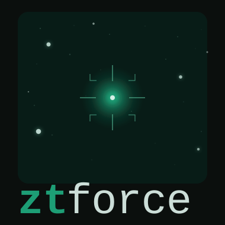

<p align="center">
  
</p>

# ztforce

Forced PSF photometry on ZTF science images — measures flux at a fixed sky position in every available epoch, even below the detection threshold, producing a calibrated AB-magnitude lightcurve.

[](https://lincc-ppt.readthedocs.io/en/latest/)

[](https://pypi.org/project/ztforce/)
[](https://github.com/Adam-Boesky/ztforce/actions/workflows/smoke-test.yml)
[](https://codecov.io/gh/Adam-Boesky/ztforce)
[](https://ztforce.readthedocs.io/)
[](https://zenodo.org/badge/latestdoi/1249800788)

## Installation

```bash
pip install ztforce
```

**Python 3.10–3.13** is supported.

### Credentials

ztforce downloads ZTF science images from IRSA and requires an IRSA account
(free at [irsa.ipac.caltech.edu](https://irsa.ipac.caltech.edu)). Set your
credentials in one of three ways:

**Environment variables (recommended for scripts/CI):**
```bash
export ZTFORCE_IRSA_USER=your_username
export ZTFORCE_IRSA_PASS=your_password
```

**Config file** at `~/.ztforce/config.toml`:
```toml
[credentials]
irsa_user = "your_username"
irsa_pass = "your_password"
```

**Direct argument:**
```python
from ztforce import build_config
config = build_config(irsa_user="your_username", irsa_pass="your_password")
```

## Quick start

```python
from ztforce import run_forced_photometry

# Measure flux at a fixed position across all ZTF g- and r-band epochs.
# A tqdm progress bar tracks downloads and PSF fitting; results are cached
# on disk so repeated calls return instantly.
lcs = run_forced_photometry(ra=210.08, dec=-6.88, bands=["g", "r"])

lcs["g"].df              # pandas DataFrame of all epochs
lcs["g"].stack()         # inverse-variance weighted stack of all good epochs
lcs["g"].rolling_stack(window=30.0)  # 30-day stacks (window_unit="days" | "years" | "images")
lcs["g"].save("my_source_g.ecsv")   # save to ECSV
```

### Batch processing

```python
from astropy.coordinates import SkyCoord
from ztforce import run_forced_photometry_batch

targets = SkyCoord(ra=[210.08, 130.13], dec=[-6.88, 19.70], unit="deg")

# Processes targets in parallel; downloads are shared across all workers.
results = run_forced_photometry_batch(targets, bands=["g", "r"], n_workers=4)

results[0]["g"].stack()  # stacked photometry for first target, g-band
```

### What each epoch holds

Every exposure whose footprint contains the target appears as a row, with its ZTF `field`, `ccdid` and `qid`:

- `flux`, `flux_err`: instrumental flux (DN) on the epoch's `zero_point`, kept at any S/N.
- `mag`, `mag_err`: AB magnitudes (ZTF calibration, zero colour, like ZTF's own catalogs), **only for detections** (S/N ≥ 3). A good non-detection has a 5σ `upper_limit` at the target instead.
- `flags`: a bitmask, 0 = good. Flagged epochs are never detections or stacked:

| Bit | Meaning |
|---|---|
| 1 | fit failed (target off the image or in a NaN region) |
| 2 | image or PSF could not be read |
| 4 | bad photometric calibration (archive `infobits` ≥ 2²⁵) |
| 8 | noisy image (robust pixel noise > 25 DN) |
| 16 | seeing > 4″ |
| 32 | IRSA does not serve the file |
| 64 | download kept failing (retried on the next run) |
| 128 | saturated pixel under the PSF |

Epochs the archive metadata already marks as bad (bits 4, 16) are not downloaded unless `measure_flagged=True`. Files IRSA does not serve (some exposures listed in its metadata have no files) are not re-requested unless `retry_unavailable=True`. A warning summarises epochs that could not be measured.

### Stacking and uncertainties

Quality cuts and stacking follow the [ZFPS user guide](https://irsa.ipac.caltech.edu/data/ZTF/docs/ztf_zfps_userguide.pdf): stacks combine all good epochs in flux, rescaled to a common zero point and inverse-variance averaged, and are reported as a 5σ upper limit below S/N 3.

Uncertainties are statistical (sky + Poisson). They describe the scatter of faint and blank-sky measurements well, but omit calibration and PSF systematics, so they are **underestimated for bright sources** (ZTF's own catalogs carry a ~1% floor). The fit is on science images, not difference images, so light from an extended host can vary with seeing.

### Caching

Lightcurves are cached per position and band. A cached lightcurve does not pick up epochs taken after it was built; ztforce warns once it is over 30 days old, and `force_recompute=True` rebuilds it.

### Accuracy

For isolated stars, ztforce reproduces the fluxes in ZTF's own per-image PSF catalogs (`psfcat`, same pixels and PSF) to within ~1%, with ~1% scatter and reduced χ² ≈ 1, and blank sky comes out consistent with zero. `tests/ztforce/integration/test_psfcat_agreement.py` checks this on frozen real data from several fields, quadrants, bands and seeing conditions.

## Related services

Several official ZTF services offer complementary photometry — ztforce fills a gap none of them cover:

| Service | What it does | Why you'd use ztforce instead |
|---|---|---|
| [ZTF Forced Photometry Service (ZFPS)](https://irsa.ipac.caltech.edu/data/ZTF/docs/ztf_forced_photometry.pdf) ([Masci et al. 2023](https://arxiv.org/abs/2305.16279)) | Forced PSF photometry on ZTF **difference** images at user positions | Science-image photometry avoids subtraction artifacts; no account/queue required; runs locally |
| [ZTF DR lightcurves (IRSA)](https://irsa.ipac.caltech.edu/docs/program_interface/ztf_lightcurve_api.html) | Catalog lightcurves for sources detected in ZTF data releases | Forced photometry works for transients and sub-threshold sources not in any catalog and at any arbitrary position |
| [ZuberCal](https://irsa.ipac.caltech.edu/data/ZTF/zubercal/overview.pdf) | Ubercalibrated PSF photometry catalog for PS1-matched ZTF sources | Only covers sources detected in PS1; ztforce works at any arbitrary position |

**ztforce is designed for cases where the source may not appear in any existing catalog** — supernovae, kilonova, flares, or any transient — and you need calibrated flux measurements at a fixed sky position across every available epoch, including non-detections.

## Citation

If you find ztforce useful for your work, please cite the Zenodo release:

```
@software{Boesky2026_ztforce,
  author       = {Adam Boesky},
  title        = {Adam-Boesky/ztforce: v0.1.2},
  month        = may,
  year         = 2026,
  publisher    = {Zenodo},
  version      = {v0.1.2},
  doi          = {10.5281/zenodo.20434975},
  url          = {https://doi.org/10.5281/zenodo.20434975},
}
```

## Dev Guide - Getting Started

Before installing any dependencies or writing code, it's a great idea to create a
virtual environment. LINCC-Frameworks engineers primarily use `conda` to manage virtual
environments. If you have conda installed locally, you can run the following to
create and activate a new environment.

```
>> conda create -n <env_name> python=3.11
>> conda activate <env_name>
```

Once you have created a new environment, you can install this project for local
development using the following commands:

```
>> ./.setup_dev.sh
>> conda install pandoc
```

Notes:
1. `./.setup_dev.sh` will initialize pre-commit for this local repository, so
   that a set of tests will be run prior to completing a local commit. For more
   information, see the Python Project Template documentation on 
   [pre-commit](https://lincc-ppt.readthedocs.io/en/latest/practices/precommit.html)
2. Install `pandoc` allows you to verify that automatic rendering of Jupyter notebooks
   into documentation for ReadTheDocs works as expected. For more information, see
   the Python Project Template documentation on
   [Sphinx and Python Notebooks](https://lincc-ppt.readthedocs.io/en/latest/practices/sphinx.html#python-notebooks)
